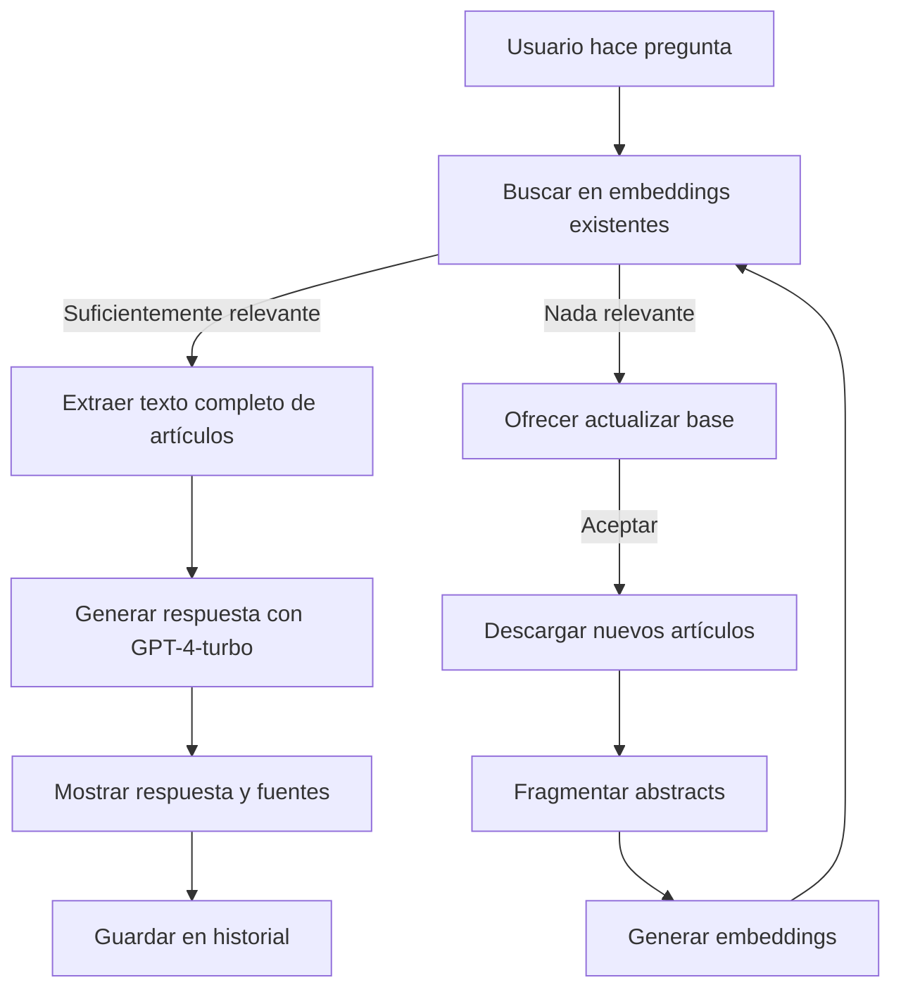

# Asistente de Investigación con Memoria

Este proyecto es un asistente de investigación ejecutado desde consola, especializado inicialmente en biología molecular. Implementa un sistema de RAG (Retrieval-Augmented Generation) para responder preguntas usando información contenida en artículos científicos, manteniendo el contexto de la conversación, actualizando su base de conocimiento y citando automáticamente las fuentes consultadas.

## Objetivos del proyecto

1. **RAG con actualización de conocimiento**: Buscar respuestas en una base local de artículos y actualizarla si es necesario.
2. **Evitar la pérdida de contexto**: Mantener un historial resumible de la conversación por sesión.
3. **Citación automática**: Incluir al final de cada respuesta las fuentes utilizadas.
4. **Búsqueda semántica**: Buscar artículos relevantes a partir de una consulta mediante embeddings.

---

## Estructura de carpetas

```
asistente_bio/
├── credentials/            # Llave de OpenAI (.env)
├── data/
│   ├── papers_raw/         # Archivos JSON con metadatos de los artículos
│   ├── papers_fulltext/    # Texto completo descargado
│   ├── fragments/          # Abstracts divididos
│   ├── embeddings/         # Archivo FAISS + metadatos
│   └── descarga_resumen.json  # Lista temporal de artículos nuevos
├── resumenes/              # Resúmenes por sesión y resultados generados
├── logs/                   # Conversaciones con fuentes y respuestas
├── src/
│   ├── asistente_principal.py       # Menú principal de interacción
│   ├── chat_asistente.py            # Chat con memoria por sesión y actualización automática
│   ├── comparar_articulos.py        # Comparación entre dos artículos científicos
│   ├── resumen_articulo.py          # Resumen individual de un artículo completo
│   ├── busqueda_semantica.py        # Búsqueda por palabra clave en abstracts
│   ├── descargar_articulos_pubmed.py# Descarga artículos desde EuropePMC
│   ├── fragmentar_abstracts.py      # Extrae los abstracts de los artículos descargados
│   └── generar_embeddings.py        # Genera embeddings de los abstracts
```

---

## Flujo general del programa



---

## Descripción de los programas

### `asistente_principal.py`

Menú central desde el cual el usuario puede escoger una de las siguientes opciones:

1. 📄 **Resumen de un artículo**: permite al usuario buscar por palabra clave, elegir entre múltiples coincidencias y recibir un resumen generado automáticamente con GPT-4-turbo. El usuario puede optar por guardar el resumen en `resumenes/`.

2. 📊 **Comparación entre artículos**: lista todos los artículos disponibles, permite seleccionar dos y genera una comparación crítica utilizando GPT-4-turbo. Las diferencias y similitudes se presentan de forma clara y estructurada, y se pueden guardar como archivo markdown.

3. 🔍 **Búsqueda semántica**: busca por palabras clave en abstracts. Si no hay coincidencias, permite descargar nuevos artículos y actualizar la base. Genera una respuesta basada solo en los textos encontrados, citando fuentes.

4. 💬 **Asistente en chat**: modo interactivo tipo chat que mantiene el contexto durante la sesión. Usa embeddings y texto completo, y propone actualizar la base si no encuentra información suficiente.

---

## Scripts auxiliares

### `descargar_articulos_pubmed.py`

Realiza búsquedas en EuropePMC. Descarga metadatos (ID, título, autores, año, abstract) y texto completo (cuando está disponible). Almacena la información en `papers_raw/` y `papers_fulltext/` y registra las descargas en `descarga_resumen.json`.

### `fragmentar_abstracts.py`

Extrae los campos de abstract de los artículos en `papers_raw/` y los guarda como fragmentos estructurados en `fragments/fragments.json`. Cada fragmento tiene un identificador único, título, año, autores y el abstract.

### `generar_embeddings.py`

Genera vectores de embeddings utilizando el modelo `text-embedding-3-small` de OpenAI. Los vectores se almacenan como índice FAISS (`index.faiss`) junto con metadatos para búsquedas rápidas por similitud semántica.

---

## Modelos utilizados

* 🔤 **`text-embedding-3-small`** (OpenAI): usado para convertir cada abstract en un vector semántico de dimensión 1536, que se almacena en un índice FAISS para búsqueda rápida.
 **`gpt-4-turbo`** (OpenAI): utilizado para generar respuestas naturales a preguntas, producir resúmenes individuales, comparar artículos y responder en modo chat. Todas las interacciones generativas del asistente se basan en este modelo.

---

## Requisitos

* Python 3.10 o superior
* Paquetes necesarios:

```bash
pip install openai faiss-cpu tqdm requests python-dotenv
```

También necesitas un archivo `.env` en la carpeta `credentials/` con tu clave:

```
OPENAI_API_KEY=sk-...
```

---

## Ejecución del asistente

```bash
python src/asistente_principal.py
```

---

## Estado actual

* [x] Descarga de artículos científicos
* [x] Fragmentación de abstracts
* [x] Generación de embeddings semánticos
* [x] RAG con búsqueda contextual y citación automática
* [x] Chat interactivo con historial de sesión
* [x] Resumen de artículos individuales
* [x] Comparación crítica entre dos artículos
* [x] Menú principal funcional

---

## Licencia

MIT
